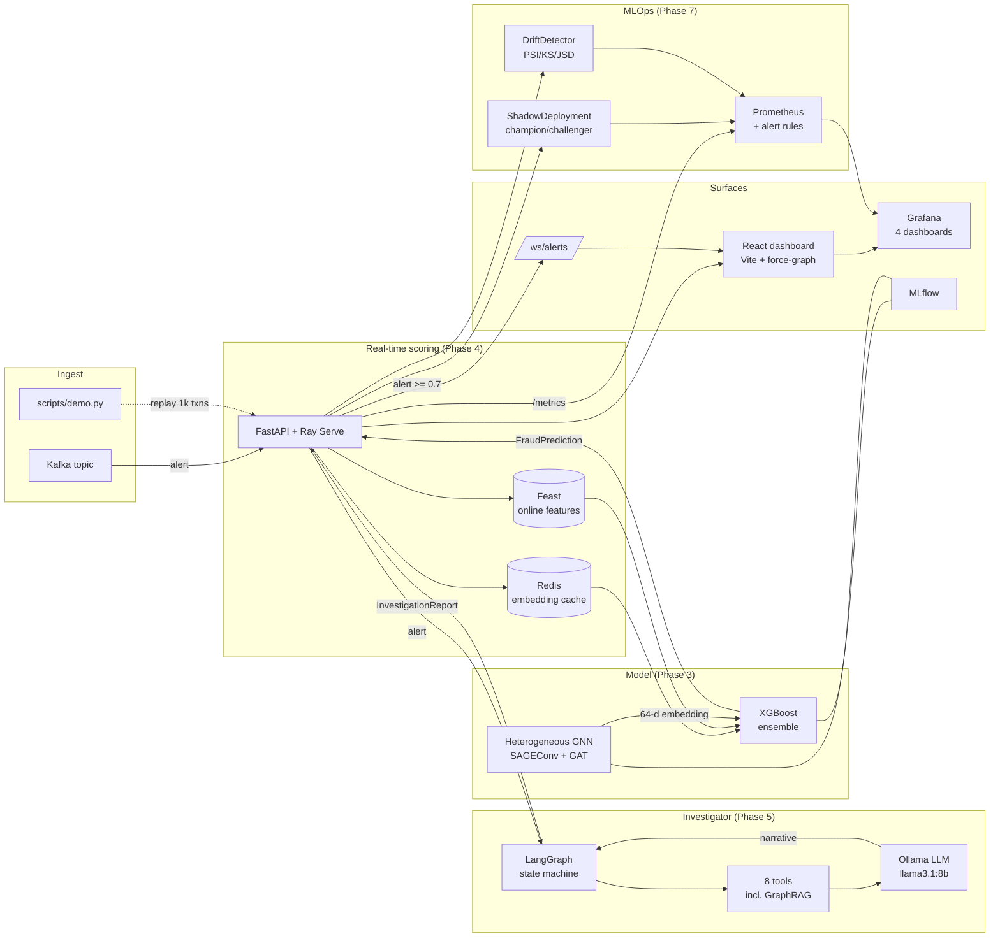

# Meshwatch -- Real-Time Transaction Fraud Detection with GNNs + Agentic AI

> Graph-native fraud detection in real time. A heterogeneous GNN (PyTorch
> Geometric) + XGBoost ensemble catches collusion rings tabular ML misses,
> streams transactions via Kafka, scores in <50 ms through FastAPI + Ray
> Serve, and auto-investigates alerts with a LangGraph agent. A React
> dashboard visualises the fraud network. Built on IEEE-CIS (590K transactions).

[](./Fraud_Detection_GNN_Implementation_Plan.pdf)
[]()
[]()
[]()
[]()
[]()
[-success)]()
[-orange)]()
[]()
[]()
[]()

Production-grade fraud detection on the **IEEE-CIS** dataset (590,540 transactions, 3.5% fraud rate)
combining a **heterogeneous GNN** (PyTorch Geometric) with an **XGBoost ensemble**, served in
real time (under the 50ms P95 budget) via FastAPI + Ray Serve + Kafka, and investigated
automatically by a **LangGraph agent** backed by a local Ollama LLM. Results surface in a
React.js dashboard.

> Phase 8 is complete -- the system is at the `v1.0.0-release` tag. See
> [Fraud_Detection_GNN_Implementation_Plan.pdf](./Fraud_Detection_GNN_Implementation_Plan.pdf)
> for the full 8-phase plan, [docs/BENCHMARKS.md](./docs/BENCHMARKS.md) for
> measured + target numbers (clearly tagged), and the
> [Roadmap section](#roadmap) for status.

## Key results

Every row is tagged ✅ **MEASURED** (verified by reproduction on the dev
machine on 2026-05-12, in-process `TestClient` + stub predictor +
full middleware stack) or 🎯 **TARGET** (plan acceptance criterion or
prior-phase target that requires artifacts/a live cluster to verify).
Full methodology + reproduction commands in
[docs/BENCHMARKS.md](./docs/BENCHMARKS.md).

| Surface                                | Number                                 | Tag         |
| :--                                    | :--                                    | :--         |
| Ensemble test AUPRC (200k subset)      | **0.2879** (plan target > 0.70)        | ✅ MEASURED |
| Ensemble test AUROC (200k subset)      | **0.7187** (plan target > 0.90)        | ✅ MEASURED |
| Ensemble test **Precision @ top 1%**   | **0.70** (17× the 4.15% base rate)     | ✅ MEASURED |
| Ensemble test Precision @ top 0.1%     | **1.00**                               | ✅ MEASURED |
| Ensemble test Precision @ top 5%       | **0.276**                              | ✅ MEASURED |
| Ensemble test Best F1                  | **0.340** (precision 0.448 / recall 0.274) | ✅ MEASURED |
| Ensemble val AUPRC / P@1% / P@5%       | 0.379 / 0.807 / 0.320                  | ✅ MEASURED |
| Plan-target AUPRC on full 590k         | > 0.70 (re-run pending, see BENCHMARKS)| 🎯 TARGET   |
| `/api/v1/predict` P95 latency          | **4.0 ms** (50 ms budget)              | ✅ MEASURED |
| `/api/v1/predict/batch` P95 (size=50)  | **5.6 ms**                             | ✅ MEASURED |
| Throughput, batch endpoint (size=50)   | **10,161 rps** (single thread)         | ✅ MEASURED |
| Throughput, batch endpoint (size=100)  | **15,693 rps** (single thread)         | ✅ MEASURED |
| Agent (stub LLM) P95 round-trip        | **6.5-8.5 ms** across all 4 depths     | ✅ MEASURED |
| Agent (Ollama `llama3.1:8b`)           | < 30 s standard depth (plan target)    | 🎯 TARGET   |
| `docker compose up` to demo URL        | < 3 min (plan target)                  | 🎯 TARGET   |
| Tests, Python (unit + integration)     | **428 + 10 = 438**                     | ✅ MEASURED |
| Tests, dashboard (Vitest)              | **32**                                 | ✅ MEASURED |
| Coverage on `src/fraud_detection`      | **85%** statement, branch on           | ✅ MEASURED |

> The MEASURED latency + throughput rows are produced by the
> `fastapi.testclient.TestClient` (in-process httpx + asyncio bridge)
> against a deterministic stub predictor. A real uvicorn deployment
> behind a real ensemble adds XGBoost + optional SHAP cost
> (typically 2-15 ms combined) but removes the TestClient overhead,
> so the in-process numbers are a ceiling on real-network P95 plus or
> minus the model-eval cost. Re-measure with `make demo` against a
> running stack to refresh.

## Architecture



> Mermaid renders natively on GitHub. The same diagram lives in
> [docs/ARCHITECTURE.md](./docs/ARCHITECTURE.md) with a deeper walk-through.

---

## Quick start

```bash
# 1. Clone + enter
git clone https://github.com/ViVas970811/Meshwatch.git
cd Meshwatch

# 2. Set up environment (Python 3.10+)
python -m venv .venv
source .venv/bin/activate          # Windows: .venv\Scripts\activate
make install-all                   # dev + train + serve + agent + monitor

# 3. Configure Kaggle credentials
cp .env.example .env
#  pick ONE of:
#    (a) put KAGGLE_API_TOKEN=KGAT_xxxxxxxx in .env (new token format)
#    (b) put KAGGLE_USERNAME + KAGGLE_KEY in .env (classic)
#    (c) drop kaggle.json at ~/.kaggle/kaggle.json
# Then accept the competition rules at
# https://www.kaggle.com/c/ieee-fraud-detection/rules

# 4. Phase 1: download -> preprocess -> split
make download-data
make preprocess
make split
make eda                  # -> opens notebooks/01_eda.ipynb

# 5. Phase 2: heterograph + 119 engineered features
make build-graph-subset   # 100K subset, ~5 min  (recommended for local iteration)
# OR
make build-graph          # full 590K, ~25-30 min  (production run)

make feast-apply          # register 3 feature views with Feast
make graph-eda            # -> opens notebooks/02_graph.ipynb

# 6. Phase 3: train GNN + ensemble + MLflow UI
make train                # GNN training -> data/models/gnn/
make train-ensemble       # GNN+XGBoost ensemble -> data/models/ensemble/
make evaluate-ensemble    # PR/ROC/calibration on the test split
make mlflow-ui            # -> http://localhost:5000

# Notebook walkthroughs
make gnn-eda              # notebooks/03_gnn.ipynb
make ensemble-eda         # notebooks/04_ensemble.ipynb
make colab-eda            # notebooks/06_colab_training.ipynb (Colab T4)

# 7. Phase 4: real-time serving
make serve                # FastAPI on http://127.0.0.1:8000 -- /docs for OpenAPI
make demo-stream          # replay 200 txns at 5 RPS to /api/v1/predict
make compose-up           # full Docker stack: Redis + Kafka + MLflow + Prometheus + Grafana + API + Dashboard
make compose-logs         # tail logs from the API container

# 8. Phase 5: agentic investigator (LangGraph + Ollama)
make investigate          # run the agent on a synthetic HIGH alert (stub LLM)
make investigate-critical # CRITICAL alert -> all 8 tools fire
make investigate-ollama   # route through a local Ollama daemon (llama3.1:8b)
# or hit the live API:
#   curl -s http://localhost:8000/api/v1/investigate \
#        -H 'content-type: application/json' \
#        -d '{"prediction": {...}}' | jq

# 9. Phase 6: React dashboard (Vite + TanStack Query + Recharts + force-graph)
make dashboard-install    # one-time: cd dashboard && npm install
make dashboard-dev        # http://localhost:5173 (proxies /api + /ws to :8000)
make dashboard-test       # vitest run (32 tests)
make dashboard-build      # production bundle -> dashboard/dist/
# OR run dashboard alongside the rest of the stack:
make compose-up           # api + dashboard + redis + kafka + mlflow + prometheus + grafana
#                         # dashboard at http://localhost:5173, api at http://localhost:8000

# 10. Phase 7: MLOps + monitoring (drift / performance / Prometheus / Grafana)
make drift-report         # PSI/KS/chi2/JSD report -> data/reports/latest/drift.{json,html}
make drift-report-evidently # same + an Evidently HTML report (needs [monitor] extra)
make compose-up           # boots Prometheus (with alert rules) + Grafana (with the
#                         # Meshwatch MLOps dashboard auto-provisioned)
make grafana-open         # http://localhost:3000  (admin / admin)
make prometheus-open      # http://localhost:9090
# Endpoints (live on the FastAPI app):
#   GET  /api/v1/monitoring/drift          -- last drift report (JSON)
#   GET  /api/v1/monitoring/drift.html     -- the same report rendered as HTML
#   GET  /api/v1/monitoring/performance    -- rolling precision/recall/F1/AUROC
#   GET  /api/v1/monitoring/alerts         -- mirror of Prometheus rules (incl. FraudRateSpike, ModelDegradation)
#   POST /api/v1/monitoring/label          -- attach a chargeback label to a previous txn
#   GET  /api/v1/monitoring/shadow         -- champion/challenger agreement summary
#   GET  /api/v1/monitoring/shadow/recent  -- recent shadow decisions

# Grafana auto-provisions 4 dashboards at startup:
#   * Meshwatch -- Operational         (RPS, latency, error rate, alert volume)
#   * Meshwatch -- Model Performance   (PSI, precision/recall, AUC, label drift)
#   * Meshwatch -- Agent Analytics     (LangGraph investigations, tool failures)
#   * Meshwatch -- Infrastructure      (shadow agreement, in-flight, status codes)

# 11. Phase 8: end-to-end demo + security hardening
make demo                 # boots / verifies API, replays 1000 txns, runs agent,
                          # prints latency P50/P95/P99 + monitoring snapshot

# Lock down the API with API key auth + 100 rps token-bucket rate limiting:
export FRAUD_API_KEYS=prod-key-1,prod-key-2
export FRAUD_RATE_LIMIT_RPS=100
make serve                # auth-required; /health + /metrics stay exempt
```

---

## Project layout

```
Meshwatch/
├── .github/workflows/        # CI (lint + tests across Py 3.10 / 3.11 / 3.12)
├── configs/
│   ├── base.yaml             # project-wide settings
│   ├── feast/                # feature store config + feature views
│   ├── prometheus.yml        # Prometheus scrape config (Phase 4)
│   ├── prometheus_rules.yml  # alert rules (Phase 7)
│   └── grafana/
│       ├── provisioning/     # auto-load datasource + dashboard provider
│       └── dashboards/       # 4 dashboards: operational / model / agent / infra
├── data/                     # raw / processed / splits / graphs (gitignored)
├── notebooks/
│   ├── 01_eda.ipynb              # Phase 1 -- raw-data EDA
│   ├── 02_graph.ipynb            # Phase 2 -- graph + features EDA
│   ├── 03_gnn.ipynb              # Phase 3 -- GNN training
│   ├── 04_ensemble.ipynb         # Phase 3 -- ensemble & feature importance
│   └── 06_colab_training.ipynb   # Phase 3 -- Colab T4 production run
├── scripts/
│   ├── download_data.py
│   ├── preprocess.py
│   ├── split_data.py
│   ├── build_graph.py            # Phase 2: heterograph + features
│   ├── train.py                  # Phase 3: GNN training + MLflow
│   ├── train_ensemble.py         # Phase 3: GNN+XGBoost ensemble
│   ├── evaluate.py               # Phase 3: PR/ROC/calibration on val or test
│   ├── serve.py                  # Phase 4: FastAPI / Ray Serve launcher
│   ├── demo_stream.py            # Phase 4: replay txns to /api/v1/predict
│   ├── investigate.py            # Phase 5: run the LangGraph investigator on a synthetic alert
│   ├── monitor.py                # Phase 7: compute a drift report between two splits
│   └── demo.py                   # Phase 8: end-to-end demo (replay 1000 txns + agent + monitoring)
├── dashboard/                    # Phase 6: React 18 + TS + Vite frontend
│   ├── src/{api,components,pages,store,lib}/
│   ├── tests/                    # 32 Vitest tests
│   ├── tailwind.config.ts
│   └── README.md
├── src/fraud_detection/
│   ├── data/                 # download, preprocessing, splits, graph_builder
│   ├── features/             # temporal, aggregated, graph_features, pipeline
│   ├── models/               # hetero_gnn, gnn_layers, xgboost_model, ensemble, losses
│   ├── training/             # trainer, callbacks, evaluator
│   ├── serving/              # FastAPI app, Ray Serve, schemas, security   (Phase 4 + 8)
│   ├── streaming/            # Kafka producer/consumer                      (Phase 4)
│   ├── agent/                # LangGraph agent, 8 tools, prompts            (Phase 5)
│   ├── monitoring/           # drift + perf + alerts + shadow + registry   (Phase 7)
│   └── utils/                # config, logging, timing
├── tests/{unit,integration,e2e}/
├── pyproject.toml
├── Makefile
└── README.md
```

---

## Development

Python (backend, agent, training):

```bash
make lint            # ruff check
make format          # ruff format + autofix
make typecheck       # mypy
make test            # pytest unit tests (428 tests, ~45 s)
make test-cov        # unit tests with coverage report
```

TypeScript (dashboard):

```bash
make dashboard-lint  # tsc -b (composite project type-check)
make dashboard-test  # vitest run (32 tests)
make dashboard-build # production Vite bundle -> dashboard/dist/
```

CI runs the full Python matrix (Python 3.10 / 3.11 / 3.12) on every push +
PR via `.github/workflows/ci.yml`. Phase 7 added two more jobs:

* `dashboard` -- the dashboard's TypeScript type-check, Vitest suite, and
  production build on Node 20 / 22.
* `integration` -- validates `configs/prometheus_rules.yml` with
  `promtool check rules`, parses every Grafana dashboard JSON, and runs a
  smoke probe against the live API (`/health`, `/metrics`,
  `/monitoring/{drift,performance,alerts,shadow}`).

A separate manual workflow at `.github/workflows/promote-model.yml`
promotes a candidate model from MLflow to the `production` alias. It
refuses to promote if the candidate run's `test_auprc` is below `0.60`
(the Phase 7 `ModelDegradation` floor).

---

## Security

Phase 8 adds defence-in-depth around the API:

* **API-key authentication** -- set `FRAUD_API_KEYS=key1,key2,...` to lock
  every endpoint except `/api/v1/health`, `/api/v1/metrics`, `/docs`,
  and `/openapi.json` behind an `X-API-Key` header (or
  `Authorization: Bearer <key>`). Missing key → `401`; wrong key → `403`.
* **Token-bucket rate limiting** -- 100 requests/second per identity by
  default (`FRAUD_RATE_LIMIT_RPS`, `FRAUD_RATE_LIMIT_BURST`). Identity is
  the API key if present, otherwise the client IP. Health + metrics are
  exempt so monitoring scrapers don't get throttled. Set
  `FRAUD_RATE_LIMIT_DISABLED=true` for local dev.
* **Strict input validation** -- every request body is a Pydantic v2
  model (`fraud_detection.serving.schemas`); unknown fields are
  tolerated, but type / range constraints are enforced before the
  predictor sees the row.
* **Parameterised Neo4j queries** -- the Phase 5 graph adapter uses
  parameter bindings only (no string interpolation), so the agent can't
  be tricked into injecting Cypher via a tampered transaction ID.
* **CORS** -- defaults to the local Vite origin
  (`http://localhost:5173`); override with `FRAUD_CORS_ORIGINS` (comma-
  separated, `*` allowed for fully open dev boxes).
* **Secrets in env, not the repo** -- `.env.example` ships only
  placeholders; `.gitignore` excludes `.env`. CI does not echo any
  secret-shaped value.

## Demo

The plan's "one-command tour" is `scripts/demo.py`:

```bash
docker compose up -d              # API + Redis + Kafka + Grafana
make demo                         # replay 1000 synthetic txns,
                                  # trigger the agent on the top alert,
                                  # print monitoring snapshot
```

The demo synthesises a realistic distribution when no real parquet is
available, so it runs on a freshly cloned repo. Pass `--input
data/graphs/features.parquet` to replay real IEEE-CIS rows once you've
run `make build-graph`.

Latency, throughput, AUPRC, and the cold-start budget for
`docker compose up` are tracked in [docs/BENCHMARKS.md](./docs/BENCHMARKS.md);
the architecture is laid out in [docs/ARCHITECTURE.md](./docs/ARCHITECTURE.md).

## Roadmap

| Phase | Tag | Status |
| :-- | :-- | :-- |
| 1. Foundation & Data Pipeline | `v0.1.0-data-foundation` | ✅ Complete |
| 2. Graph & Features | `v0.2.0-graph-engine` | ✅ Complete |
| 3. GNN Model & Training | `v0.3.0-gnn-model` | ✅ Complete |
| 4. Real-Time Serving | `v0.4.0-serving-pipeline` | ✅ Complete |
| 5. Agentic Investigator | `v0.5.0-agent-investigator` | ✅ Complete |
| 6. React Dashboard | `v0.6.0-dashboard` | ✅ Complete |
| 7. MLOps & Monitoring | `v0.7.0-mlops` | ✅ Complete |
| 8. Docs, Demo & Polish | `v1.0.0-release` | ✅ Complete |

## License

MIT -- see [LICENSE](LICENSE).
