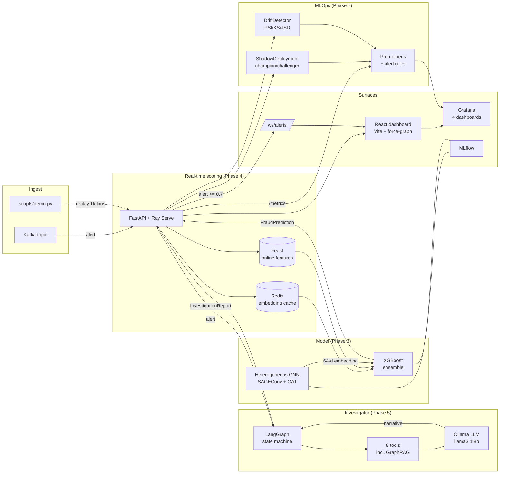
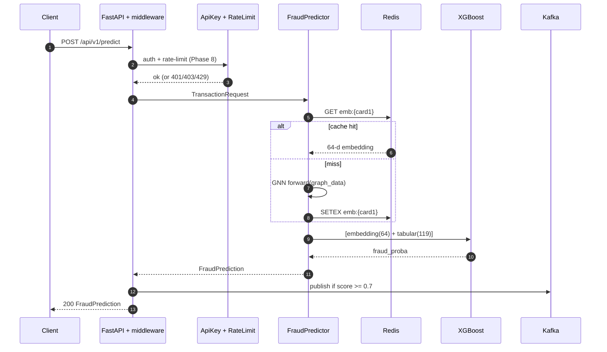
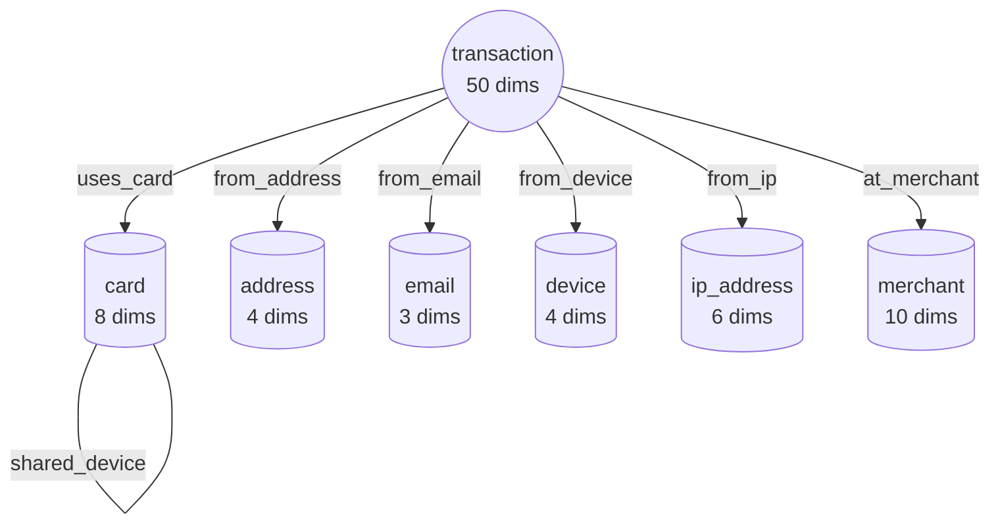
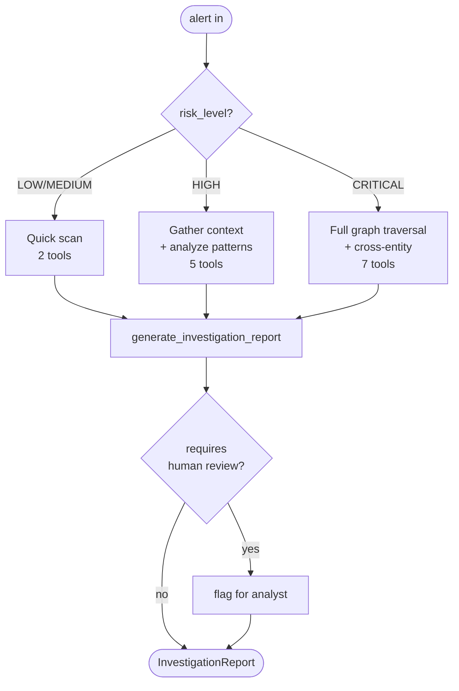
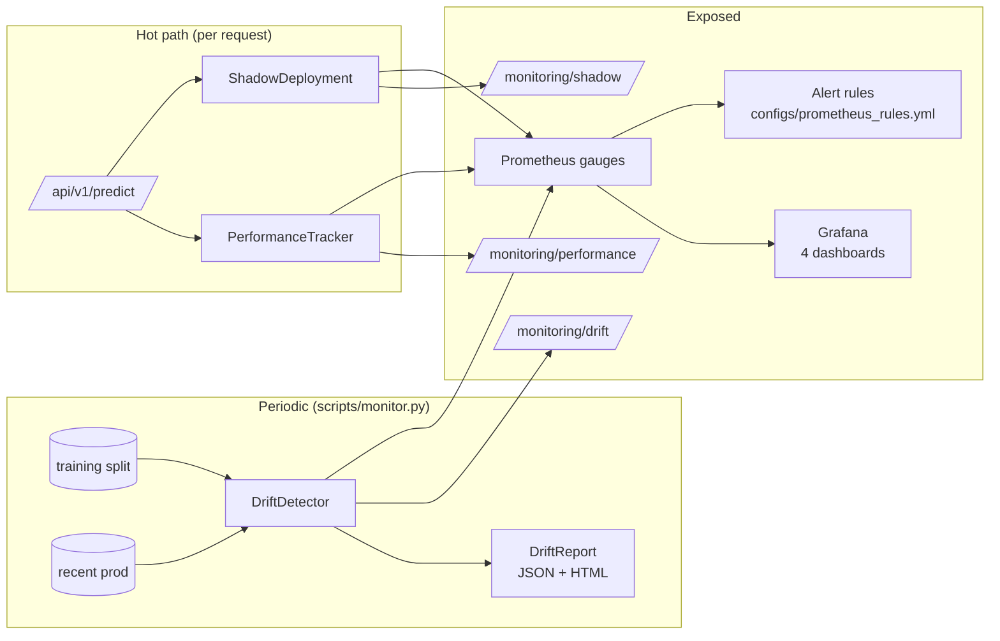
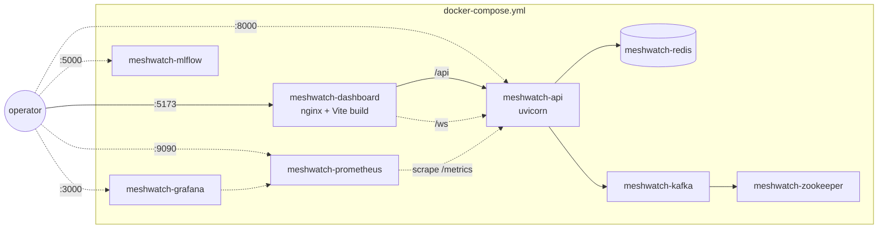

# Meshwatch -- Architecture

A guided tour of the Meshwatch end-to-end system, phase by phase. This
document complements the high-level diagram in the project [README](../README.md)
and the detailed feature breakdowns inside each phase's notebook.

## System diagram

## Request walk-through

The 50 ms P95 hot path:

## Graph schema (Phase 2)

7 node types, 8 edge types, fed by the Phase 1 IEEE-CIS preprocessor:

The `shared_*` edges are the core innovation: collusion rings show up as
cliques on those edges that flat-table models can't see.

## Investigation routing (Phase 5)

## Monitoring surface (Phase 7)

## Phase / component map

| Phase | Source                                              | Public surface                                  |
| :--   | :--                                                 | :--                                             |
| 1     | `src/fraud_detection/data/`                         | `make download-data preprocess split`           |
| 2     | `src/fraud_detection/data/graph_builder.py`         | `make build-graph`, `configs/feast/`            |
| 3     | `src/fraud_detection/{models,training}/`            | `make train train-ensemble evaluate-ensemble`   |
| 4     | `src/fraud_detection/{serving,streaming}/`          | `POST /api/v1/predict`, `make serve compose-up` |
| 5     | `src/fraud_detection/agent/`                        | `POST /api/v1/investigate`, `make investigate`  |
| 6     | `dashboard/`                                        | `http://localhost:5173`                         |
| 7     | `src/fraud_detection/monitoring/`, `configs/grafana/`, `configs/prometheus_rules.yml` | `/api/v1/monitoring/*`, Grafana :3000 |
| 8     | `src/fraud_detection/serving/security.py`, `scripts/demo.py`, `tests/integration/` | `make demo`, API key + rate limit |

## Deployment topology (Docker Compose)

All services are configured to degrade gracefully -- if Kafka, Redis, or
Neo4j are unreachable the API stays up with in-memory fallbacks.

## Coding conventions

- Python 3.10+, ruff for lint + format, mypy for type-checking (best-
  effort, not strict).
- Pydantic v2 for request/response schemas (`src/fraud_detection/serving/schemas.py`).
- structlog for logging -- every record is a JSON line in production.
- Tests in `tests/unit` are pure-Python (no docker required). Tests in
  `tests/integration` boot the FastAPI app in-process via `TestClient`.
  Marked with `pytest.mark.integration` so they're skipped by `make
  test`.
