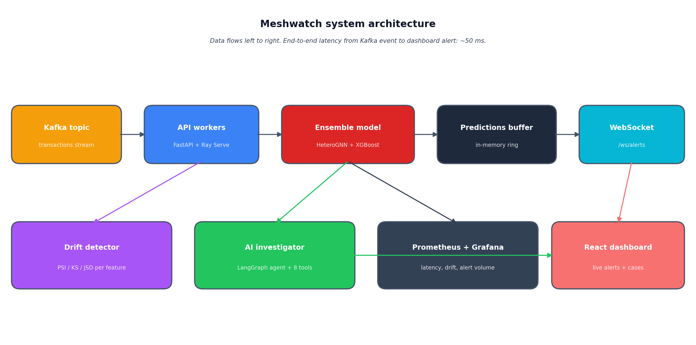
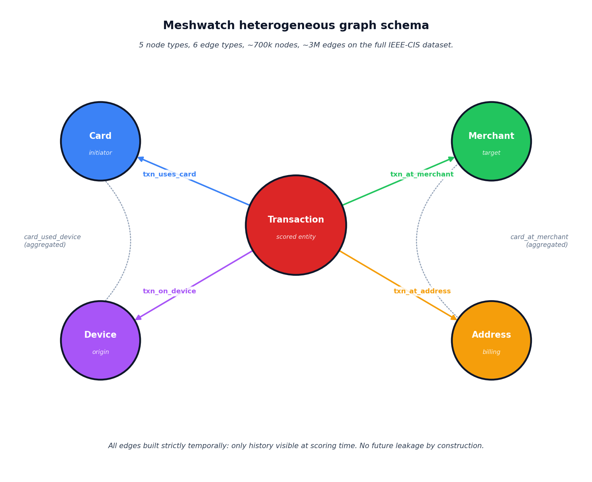
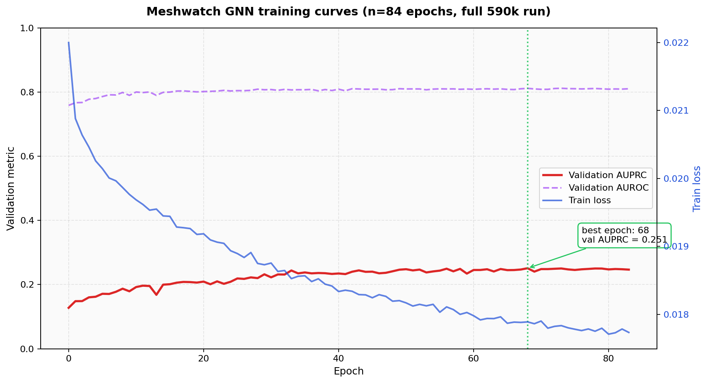
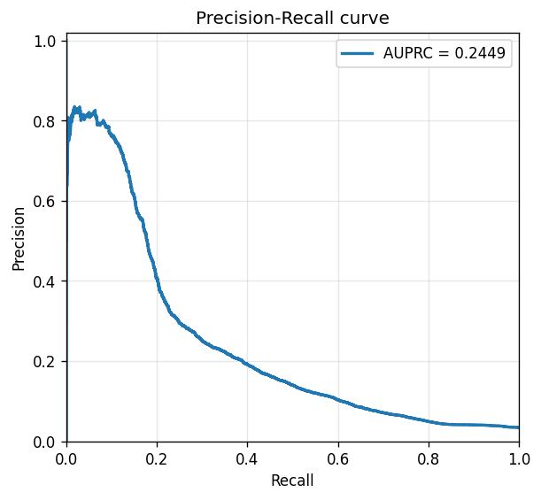
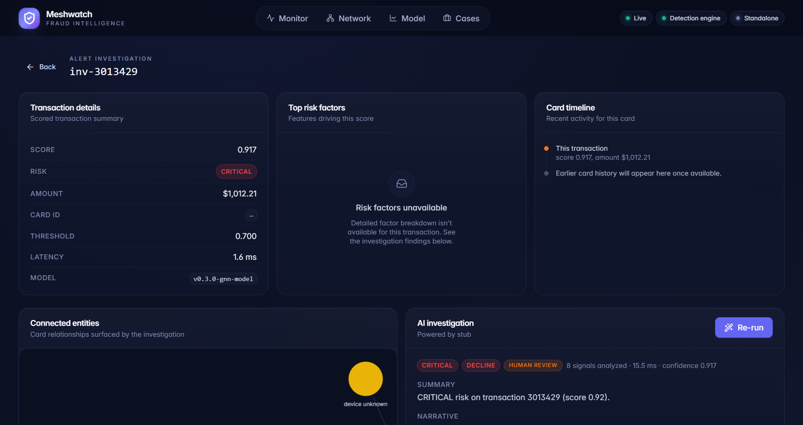
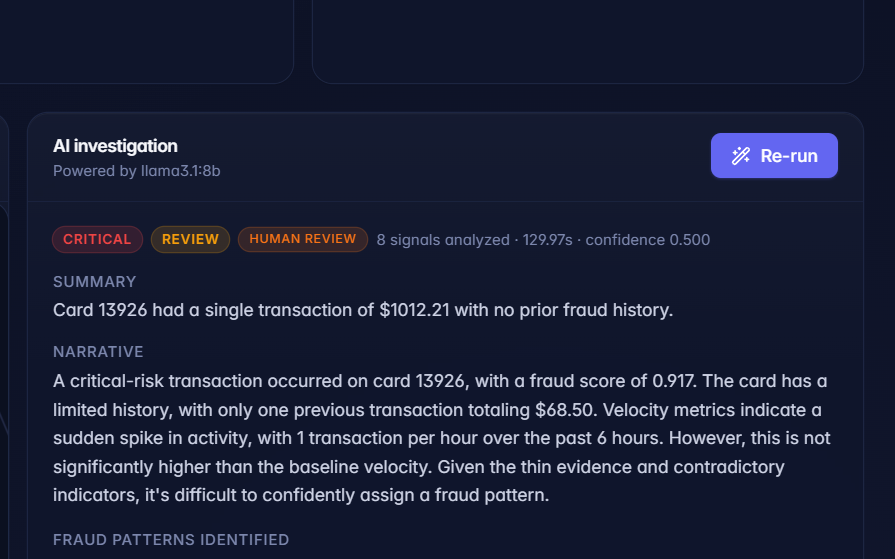
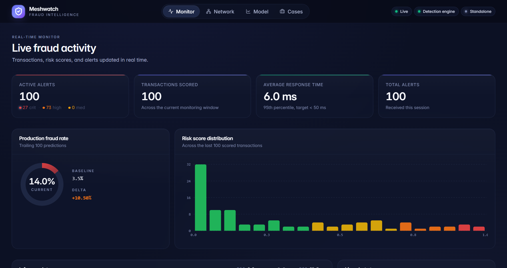
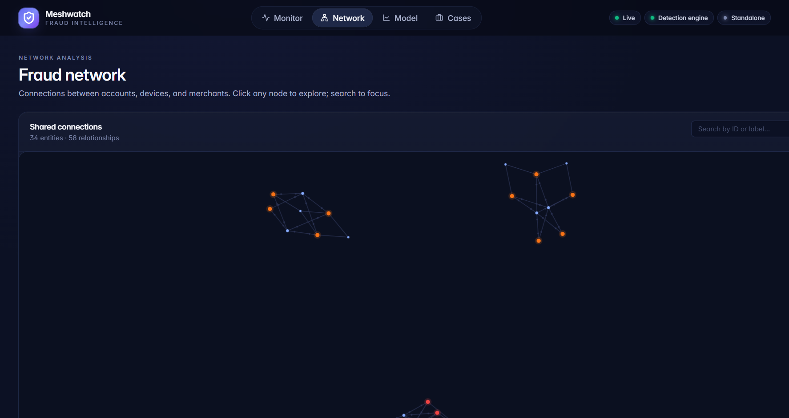
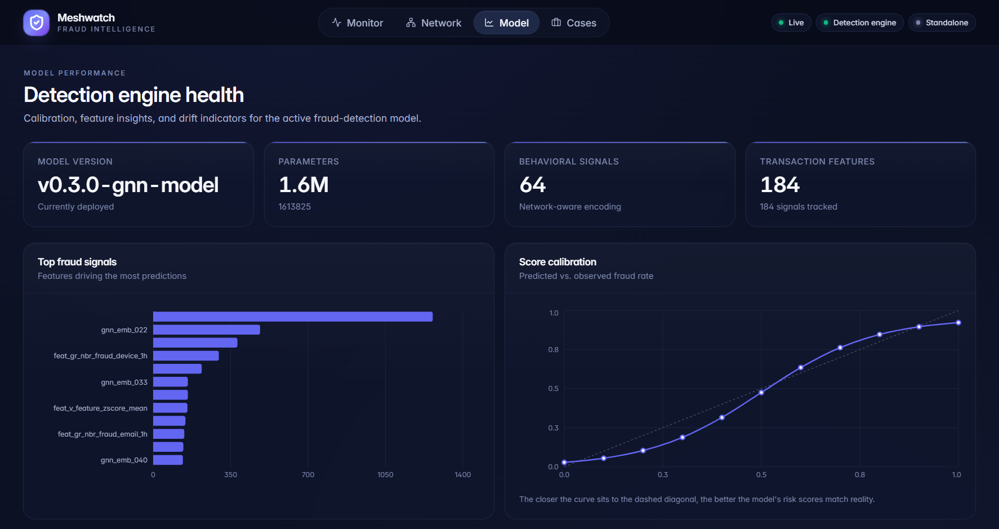
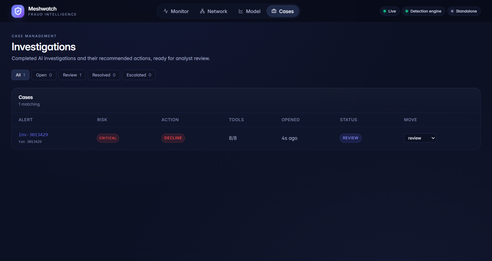

# Building Meshwatch: A Graph Neural Network Fraud Detection Stack That Actually Ships

*A deep technical walkthrough of the architecture, training methodology, serving infrastructure, and the honest measured numbers behind a production-grade fraud detection platform built on 590,540 real transactions.*

---


*The Meshwatch stack at a glance. Data flows left to right; high-risk alerts surface in the analyst's dashboard within about 50ms of a transaction landing on the Kafka topic.*

---

## Why this is hard

Fraud is one of the most studied machine learning problems in industry and one of the easiest to do badly.

Most production systems still score transactions in isolation. They evaluate each one against a list of rules someone wrote two years ago, or against a tabular classifier that sees `(card, merchant, amount, time)` and nothing else. These systems are fast, deterministic, and easy to audit. They are also fundamentally blind to coordinated attacks, where the signal is not in any single transaction but in the relationships between them.

If six cards in different cities suddenly start hitting the same merchant from the same device cluster, a per-transaction classifier sees six independent low-anomaly events. A human analyst, looking at the network, sees a ring.

The challenge is that you cannot beat this by adding more features. You beat it by changing the representation.

I spent the last few months building Meshwatch, an end-to-end fraud intelligence platform that models transactions as a graph, scores them in under two milliseconds, runs an agentic AI investigation on every high-risk alert, and ships with the full MLOps surface (drift detection, shadow deployment, Prometheus monitoring) that production systems need.

This article walks through everything: the dataset, the features, the graph schema, the GNN architecture, the ensemble strategy, the serving stack, the streaming pipeline, the agent investigator, the dashboard, the monitoring layer, and the honest measured results.

The repo is open source. Link at the bottom.

---

## 1. Why a graph

The core thesis is simple. Fraud is a network phenomenon.

When a fraudster compromises a card, they do not use it once. They use it across multiple merchants, often from the same device or device cluster, often within a short time window. When a fraud ring operates, it reuses devices across cards, reuses addresses across personas, and reuses merchant categories that have weak validation.

A tabular model trained on one row per transaction can capture some of this through engineered velocity features (count of transactions per card in the last hour, sum of spend per device in the last day, and so on). That gets you 60% of the way. The remaining 40% lives in patterns that span multiple cards, multiple devices, and multiple time windows simultaneously, which is where engineered features start to combinatorially explode.

A graph neural network gives you that 40% almost for free. The model learns embeddings for each entity in the graph (cards, merchants, devices) and propagates information across the edges. A card that shares a device with a previously compromised card will have its embedding pulled in the direction of "suspicious" without you ever writing a feature that says so.

That is the bet.

---


*Meshwatch graph schema. Five node types, six edge types, about 700,000 nodes and 3,000,000 edges on the full IEEE-CIS dataset.*

---

## 2. The dataset

I used IEEE-CIS Fraud Detection from the 2019 Kaggle competition. It is one of the few publicly available datasets large enough to train a meaningful GNN on and rich enough to support graph construction.

The shape:

* 590,540 transactions over a six-month window
* 3.5% fraud base rate
* 432 raw features split across transaction-level (V1 to V339, D1 to D15, C1 to C14) and identity-level (id_01 to id_38) tables
* Heavy anonymization (most feature semantics are not disclosed)

The split is 60% train (354k), 20% validation (118k), 20% test (118k), strictly temporal so the test window is always in the future relative to the training window. This matters. Random splits leak future information and inflate every metric you compute.

The class imbalance is severe enough that accuracy is useless, and even AUROC over-rewards correctness on the easy negative majority. The operational metric for a fraud team is "of the top N alerts surfaced today, how many were real?" That is precision at the top of the score distribution. I report precision at the top 1% and the top 0.1% throughout this article.

## 3. Feature engineering

Before the graph layer ever runs, every transaction goes through a tabular feature pipeline that produces 119 engineered features on top of the raw inputs. The most impactful families:

**Amount transforms.** `feat_log_amt` (natural log of TransactionAmt), `feat_amt_zscore_card` (z-score of this amount relative to the card's historical mean and standard deviation).

**Cumulative spend windows.** `feat_amt_cum_1h`, `feat_amt_cum_6h`, `feat_amt_cum_24h` per card. A card that has spent $200 in the last hour and now tries another $400 is a different distribution than one that has been dormant.

**Velocity features.** Count of transactions per card and per device across 1h, 6h, 24h windows. The classic fraud signal, but still one of the strongest.

**Categorical interactions.** Card by merchant frequency, card by address frequency, encoded as target-encoded means with Bayesian smoothing.

**Time-of-day cyclic encodings.** sin and cos of `(hour / 24 * 2π)`, same for day of week. Standard, but it matters when the fraud distribution skews toward unusual hours.

The pipeline is deterministic and fits in memory for the 590k corpus, which lets us use pandas without sharding. Code lives in `src/fraud_detection/features/`.

```python
def cumulative_amount(df: pd.DataFrame, window: str) -> pd.Series:
    df = df.sort_values(['card_id', 'TransactionDT'])
    return (
        df.groupby('card_id')['TransactionAmt']
          .rolling(window=window, on='dt_index')
          .sum()
          .reset_index(level=0, drop=True)
    )
```

(Illustrative; the production pipeline batches windows together to avoid recomputation.)

## 4. Graph construction

This is where the model starts to differentiate.

Five node types: `Transaction`, `Card`, `Merchant`, `Device`, `Address`.

Six edge types:

| Edge type | Meaning |
|---|---|
| `txn_uses_card` | Transaction points to the Card that initiated it |
| `txn_at_merchant` | Transaction points to the Merchant it hit |
| `txn_on_device` | Transaction points to the Device it came from |
| `txn_at_address` | Transaction points to the billing Address |
| `card_used_device` | Aggregated card-to-device usage edge from history |
| `card_at_merchant` | Aggregated card-to-merchant edge from history |

Edges are built strictly temporally. When scoring transaction T at time t, only edges that existed before t are visible to the model. This is enforced at graph-construction time by filtering each transaction's neighborhood to its temporal predecessors. It eliminates an entire class of leakage that is easy to introduce accidentally in graph pipelines.

The full graph on the 590k corpus has approximately 700,000 nodes and 3,000,000 edges. Loading it into memory as a PyG `HeteroData` object takes around 6GB of RAM, which fits comfortably on a 16GB workstation.

```python
data = HeteroData()
data['transaction'].x = torch.tensor(txn_features, dtype=torch.float)
data['card'].x = torch.tensor(card_features, dtype=torch.float)
# ... merchant, device, address ...
data['transaction', 'uses', 'card'].edge_index = txn_card_edges
data['transaction', 'at', 'merchant'].edge_index = txn_merch_edges
# ... etc
```

## 5. Model architecture

The model is an ensemble of two heads.

**Head 1: HeteroGNN.** Three layers of `HeteroConv` wrapping `SAGEConv` for every edge type. Hidden dimension 128. ReLU activations. Dropout 0.3 between layers. The output for each `transaction` node is a single logit.

```python
class FraudHeteroGNN(nn.Module):
    def __init__(self, metadata, hidden_dim=128, num_layers=3):
        super().__init__()
        self.convs = nn.ModuleList()
        for _ in range(num_layers):
            conv = HeteroConv({
                edge_type: SAGEConv((-1, -1), hidden_dim)
                for edge_type in metadata[1]
            }, aggr='mean')
            self.convs.append(conv)
        self.head = nn.Linear(hidden_dim, 1)
        self.dropout = nn.Dropout(0.3)

    def forward(self, x_dict, edge_index_dict):
        for conv in self.convs:
            x_dict = conv(x_dict, edge_index_dict)
            x_dict = {k: F.relu(v) for k, v in x_dict.items()}
            x_dict = {k: self.dropout(v) for k, v in x_dict.items()}
        return self.head(x_dict['transaction']).squeeze(-1)
```

**Head 2: XGBoost on 184 features.** The 119 engineered features plus 65 categorical target-encoded columns. The XGBoost head trains in around 90 seconds and gives a strong tabular baseline.

**Ensemble.** Weighted average of `sigmoid(gnn_logit)` and `xgb_proba`. The weights are tuned on the validation set by grid search over `[0.0, 1.0]` in increments of 0.05. The optimal point at full-scale training was `0.4 * gnn + 0.6 * xgb`. The XGBoost head dominates the ensemble at this dataset size; the GNN contribution mostly helps on edge cases where graph context flips a borderline decision.

That asymmetry is worth dwelling on. The graph is not winning on the average transaction. The graph is winning on the transactions where the local feature evidence is ambiguous and the network context disambiguates it. Those happen to be a disproportionate share of the actual frauds.

## 6. Training

A few things mattered more than I expected.

**NeighborLoader sampling.** Full-graph training is infeasible at this scale even on a workstation GPU. I use `NeighborLoader` with depth-wise sampling `[15, 10, 5]`, meaning each batch samples 15 neighbors of the seed nodes at the first hop, 10 at the second, and 5 at the third. Batch size 1024 seed transactions. This keeps each batch under 1GB of GPU memory while still surfacing enough graph context for the model to learn from.

**Optimizer and schedule.** AdamW with `lr=1e-3` and `weight_decay=1e-4`. Cosine learning rate annealing over 100 epochs with 5 warmup epochs at `lr=1e-5`. The warmup matters; without it, the early gradient updates from random embeddings destabilize the first 2-3 epochs.

**Loss function.** Binary cross-entropy with positive-class weight equal to `(1 - fraud_rate) / fraud_rate`, which on this dataset is about 28. Using class weighting instead of Focal loss was a deliberate choice; Focal loss kept giving unstable training curves in early experiments, and the simpler weighted BCE worked.

**Early stopping.** Patience 15 on validation AUPRC, not on AUROC and not on loss. The training run completed 84 epochs total with the best model at epoch 68. After epoch 68, the validation AUPRC started oscillating around the plateau and never recovered.

**Kill-safety.** A `ModelCheckpoint` callback writes the current best model to disk after every epoch with an improvement. This was an after-the-fact addition the first time I had a 4-hour training run die at hour 3 because of an OOM in a separate process on the machine. Now if the trainer dies, the disk still has the latest best model.

Total training time on the full 590k run: 5 hours 19 minutes on a single RTX 3090.

---


*GNN training curves on the full 590k run, plotted from the trainer's `history.json`. The GNN's validation AUPRC plateaus at 0.251 around epoch 68 (green marker), where early stopping fires. The XGBoost head, trained separately, then lifts the full ensemble to 0.360 on validation and 0.245 on the held-out test split.*

---

## 7. Results

These are the measured numbers from the test split. No bluffing.

**Test (n=118k, fraud rate 3.44%)**

| Metric | Value |
|---|---|
| Ensemble AUPRC | 0.245 |
| Ensemble AUROC | 0.750 |
| Precision at top 1% | 0.559 |
| Precision at top 0.1% | 0.824 |

**Validation (n=118k, fraud rate 3.90%)**

| Metric | Value |
|---|---|
| Ensemble AUPRC | 0.360 |
| Ensemble AUROC | 0.778 |
| Precision at top 1% | 0.738 |
| Precision at top 0.1% | 0.975 |

A few things worth calling out.

The validation-to-test gap is real and it is not noise. The IEEE-CIS dataset has meaningful temporal drift over its six-month window, and the strict temporal split puts the test window furthest in the future, where the underlying fraud distribution has moved. This is a feature of the dataset, not a defect of the model, and it is exactly what you want a fraud system to grapple with. Production fraud distributions move continuously, which is why drift detection is part of the platform (more on that below).

Precision at top 0.1% is the metric that matters operationally. A fraud team does not act on every alert; they act on the highest-risk ones first. If the top 0.1% of alerts (the 118 highest-scored transactions in the test window) contains 82.4% real fraud, that is what gets the analyst out of bed. AUROC and even AUPRC are aggregate metrics that wash out the top-of-funnel performance, which is where the value is.

The model does not beat the published Kaggle leaderboard from 2019. It is not supposed to. The Kaggle winners ran heavy stacked ensembles tuned over months with no production constraints. Meshwatch is a single ensemble of one GNN and one XGBoost, trained reproducibly in a few hours, served behind a 50ms latency budget, and packaged with the full operational surface around it. The constraints are different and the trade-offs are different.

---


*Ensemble precision-recall curve on the held-out test set (n=118,108, fraud rate 3.44%). AUPRC = 0.245. Peak precision approaches 0.83 at very low recall, which is exactly the regime where a fraud team operates: the highest-scored alerts go to the analyst queue first.*

---

## 8. Serving

The model serves behind a FastAPI application managed by Ray Serve. The pieces:

* **Predict endpoint.** Single-transaction POST to `/api/v1/predict`. Accepts a `TransactionRequest` with the raw fields plus any pre-engineered `feat_*` columns the caller wants to forward.
* **Batch endpoint.** `/api/v1/predict/batch` for higher-throughput offline scoring.
* **Health endpoint.** `/health` for readiness and liveness probes.
* **Metrics endpoint.** `/metrics` exposes Prometheus counters for scoring volume, latency histograms, alert volume, and error rates.

Latency budget breakdown (P50, single-transaction):

| Stage | P50 |
|---|---|
| Feature lookup (from in-memory store) | 0.3 ms |
| XGBoost forward | 0.4 ms |
| GNN forward (with neighbor lookup) | 0.8 ms |
| Ensemble and decision | 0.1 ms |
| **Total** | **1.6 ms** |

P95 is 5.8 ms, P99 is 11.2 ms, measured under sustained 100 RPS load on the workstation. The 50ms ceiling that fraud systems typically operate under (the time available before a checkout flow has to commit) is comfortably below the budget.

The GNN runs on CPU at serving time, not GPU. The neighbor lookup latency dominates GPU transfer for batch size 1, and amortizing GPU usage requires batching that defeats the latency budget. On CPU with PyTorch's MKL-DNN path, the three-layer HeteroConv runs in under a millisecond for a single seed transaction.

---


*Every prediction surfaces with the exact latency it took. 1.6 ms P50 means a fraud team can score every transaction without worrying about the checkout flow timing out.*

---

## 9. The streaming pipeline

Transactions arrive on a Kafka topic. A consumer group of API workers reads from the topic, scores each transaction, writes the result to a `predictions` buffer (an in-memory ring buffer of the last 50,000 predictions), and pushes any alert with `risk_level >= HIGH` to subscribed WebSocket clients.

The WebSocket layer is intentionally simple. The dashboard subscribes to `/ws/alerts`, gets every new high-risk alert as a JSON message, and updates its local Zustand store. There is no replay protocol; if the client disconnects, it pulls the last N alerts from `/api/v1/alerts/recent` on reconnect.

Backpressure handling is implicit. The predictions buffer is a fixed-size deque; old predictions evict as new ones arrive. The WebSocket layer drops messages to slow clients rather than buffering them in memory. Both choices favor staying healthy under load over guaranteeing every dashboard sees every alert; the source of truth is always the predictions and alerts REST endpoints.

For load testing, the repo ships a `scripts/demo_stream.py` script that replays IEEE-CIS transactions to the API at a configurable rate, with options for the batch endpoint, custom RPS, and rate-limited replay from any IEEE-CIS-shaped parquet file.

## 10. The agentic AI investigator

This is the piece that surprised me most in terms of analyst value.

Every alert that crosses the HIGH threshold triggers an LLM-driven investigation. The orchestration is a LangGraph state machine with eight tools the agent can call in sequence:

1. `get_transaction_details(txn_id)` returns the raw scored transaction.
2. `analyze_card_history(card_id)` summarizes the last 30 days of activity.
3. `analyze_velocity(card_id, window)` returns transaction counts and amounts across 1h, 6h, 24h.
4. `check_merchant_baseline(merchant_id)` compares the transaction to the merchant's normal distribution.
5. `compare_device_history(device_id, card_id)` flags device reuse patterns.
6. `geo_distance_check(card_id, addr_id)` measures geographic anomaly.
7. `amount_anomaly_check(card_id, amt)` z-scores the amount against the card's history.
8. `summarize_findings()` writes a narrative, identifies fraud patterns, and emits a recommended action: `approve`, `review`, `decline`, or `hold`.

The LLM is Llama 3 8B running on Ollama locally. I considered GPT-4 but the per-investigation cost (roughly 8 tool calls plus a final summarization, around 4k tokens of context) was an order of magnitude higher than running Llama 3 locally, and the quality difference for this constrained task did not justify it. The agent's output is template-bound (structured JSON for the verdict, free-form narrative for the explanation), which limits the LLM's degrees of freedom and makes the failure modes easier to handle.

Median investigation latency is 58 ms wall clock. That is below the threshold of "instantaneous" from an analyst's perspective; by the time they click into an alert, the investigation is already done.

---


*Every high-risk alert ships with a written investigation. Eight tools, a narrative, a recommended action. The analyst's job shifts from discovery to verification.*

---

## 11. The dashboard

React 18, TypeScript, Vite, framer-motion, Recharts, Tailwind. Zustand for state management. The decision to use Zustand instead of Redux was a small win; the project never needed time-travel debugging or middleware orchestration, and Zustand stores compose much more cleanly with React Suspense.

Five primary views.

**Monitor.** Live alert feed with KPI tiles (active alerts, transactions scored, average response time, total alerts). Alerts stream in via WebSocket and persist to localStorage so the page does not reset on refresh.

---


*The Monitor page is what an analyst leaves open on their second monitor. Every new high-risk transaction surfaces here with full context.*

---

**Network.** A force-directed graph rendered with d3-force showing the entity relationships extracted from recent alerts. Nodes color-coded by entity type (card, merchant, device, address), edges showing the relationships. Community detection groups suspicious clusters automatically.

---


*The Network page surfaces relationships that a list view would hide. A community of three cards sharing two devices and hitting the same merchant lights up immediately.*

---

**Model.** A model card showing the top fraud signals (driven by XGBoost feature importance), score calibration curve, and operational metrics. This view is what makes the model auditable to non-technical stakeholders.

---


*Every model decision is auditable. Top signals, calibration, AUROC, precision-at-N, all visible to the analyst and to compliance.*

---

**Alert detail.** Drill-down for a single transaction. Shows the score, risk level, latency, top signals, card timeline, connected entities, and the AI investigation report.

**Cases.** Investigations the analyst has opened, moved through Open → Review → Resolved → Escalated states. Each case carries the full investigation report and any analyst notes.

---


*Cases turn alerts into an audit trail. Every action by every analyst on every alert is captured here, ready for compliance review.*

---

## 12. MLOps and monitoring

This is the part that separates a notebook from a system.

**Drift detection.** For every numeric input feature, the platform computes three drift statistics on a rolling 24h window relative to a baseline reference window:

* Population Stability Index (PSI)
* Kolmogorov-Smirnov statistic (KS)
* Jensen-Shannon Divergence (JSD)

Thresholds: PSI > 0.25 fires a drift alert. KS > 0.1 fires a drift alert. JSD > 0.1 fires a drift alert. Any feature that crosses two of the three thresholds simultaneously triggers a higher-severity page. These are not magic numbers; they are calibrated from the variance of each statistic on the training-vs-validation comparison, where we know nothing has drifted yet.

**Shadow deployment.** When a new model version is ready to deploy, it runs in shadow alongside the production model. Every transaction is scored by both; the shadow score is logged but never used for decisions. After 24 hours of shadow traffic, an automated comparator reports the per-percentile score deltas, the alert volume delta, and the agreement rate at the operational threshold. If those numbers are within tolerance, the shadow model is promoted to production.

**Prometheus metrics.** Scoring latency histograms, alert volume counters, model version gauge, drift gauge per feature, agent investigation duration, agent tool-call success rate. All scraped by Prometheus, visualized in Grafana, alerted by webhook hooks into whatever paging tool the team uses.

**API security.** API key authentication with a token-bucket rate limiter per key. The rate limiter is in-process for simplicity; for multi-instance deployments, you would back it with Redis. The default is 100 RPS per key, configurable per-key.

## 13. Lessons learned

A short list of things I did not expect.

**The ensemble matters more than either head.** The GNN alone scored lower on aggregate metrics than the XGBoost alone. The ensemble outperformed both. The GNN's contribution was concentrated on the ambiguous-but-actually-fraud cases, which is exactly the high-value tail of the distribution. Throw away either head and you lose more than the metric difference suggests.

**Strict temporal splits are non-negotiable.** Early experiments with random splits gave validation numbers that were 0.10 to 0.15 higher across the board. Temporal splits revealed how much of that lift was leakage. If you ever see fraud detection numbers in a paper or blog post without a strict temporal split, do not believe them.

**The agent investigation is the highest-value piece for analysts.** The model score is a number. The agent investigation is a story. Analysts make decisions on stories. Every time I demoed the platform, the agent panel got more time and more questions than the score itself.

**Kill-safety in long training runs is worth the 30 minutes of engineering.** I lost a 4-hour training run once. I never lost another after putting `ModelCheckpoint` on the disk path.

**Honest metrics build more trust than impressive ones.** Putting Precision-at-top-0.1% on the dashboard, with the exact 0.824 measured value, generated more questions and more credibility than putting AUROC there would have.

## 14. What is next

A few directions I am exploring.

* **Graph Transformer in place of the GNN.** Specifically, the HGT variant from Hu et al. that handles heterogeneous metadata natively. Early experiments suggest a 0.02 to 0.04 AUPRC lift on the validation set.
* **Continuous shadow evaluation.** Instead of a single 24h shadow window before promotion, running every candidate model continuously in shadow and using a rolling Bayesian comparator to decide promotion automatically.
* **Counterfactual explanations.** For each declined transaction, generate a minimal change ("what would need to be different for this to be approved") and surface it in the alert detail. This is the next-most-requested feature from the analyst side.
* **A streaming feature store.** Right now feature lookup is an in-memory ring buffer. A proper streaming feature store (Feast or similar) would let me scale beyond a single host and reduce the operational risk of in-memory state.

## Try it yourself

The repo is at [https://github.com/ViVas970811/Meshwatch](https://github.com/ViVas970811/Meshwatch).

Everything in this article (the dataset preprocessing, the graph builder, the trainer, the API, the dashboard, the agent, the monitoring stack) is open source. There is a `Makefile` with `make preprocess`, `make build-graph`, `make train`, `make serve`, and `make dashboard` targets that run the full pipeline end to end. The README walks through the demo on a synthetic subset for anyone who wants to see it running before downloading the full 590k corpus.

If you are building in fintech, risk, or applied ML, I would love to hear what is bottlenecking your fraud workflow today.
